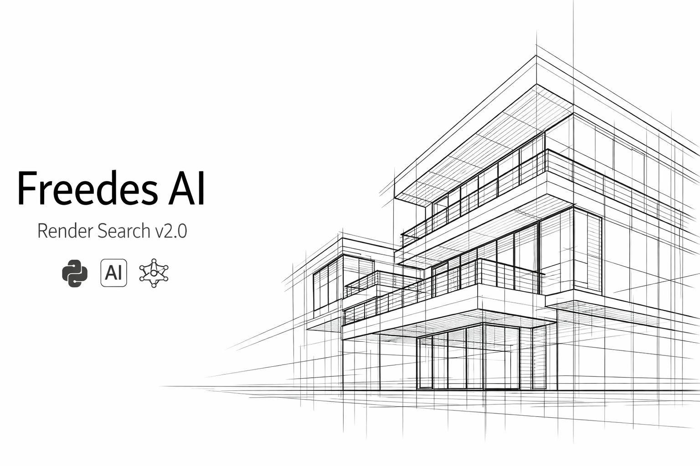

# 🏛️ Freedes AI Render Search v2.0




**Інтелектуальна екосистема для архітекторів та візуалізаторів.** Система дозволяє миттєво знаходити потрібні ракурси, матеріали або об'єкти у вашій локальній базі рендерів за допомогою нейромереж.

---

## ✨ Ключові можливості

* **🔍 Гібридний пошук:** Шукайте за картинкою, за текстом або комбінуйте обидва методи (наприклад: фото вітальні + текст *"night lighting"*).
* **🎯 Розумне кадрування (Cropper):** Виділяйте конкретну частину рендера (крісло, змішувач або текстуру стіни), і система знайде схожі деталі в інших проектах.
* **🤖 Розпізнавання об'єктів:** Завдяки **YOLOv8** система при індексації "бачить" окремі предмети. Це дозволяє знаходити об'єкти, навіть якщо вони займають лише малу частину кадру.
* **⚡ Інкрементальна індексація:** Програма розуміє, які файли вже є в базі, і обробляє лише **нові** додані зображення. Це економить години часу на великих архівах.
* **🔗 Підтримка ярликів (.lnk):** Не потрібно копіювати гігабайти даних. Просто закиньте ярлики на ваші робочі сервери чи диски у папку `my_renders`.
* **☁️ Синхронізація з Miro (Beta):** Масове завантаження рендерів з ваших Miro-дощок у максимальній якості (HD).

---

## 🚀 Швидкий старт

### 1. Підготовка
* Переконайтесь, що у вас встановлено [Python 3.10+](https://www.python.org/downloads/).
* Завантажте і розархівуйте архів з репозиторію *зелена кнопка зверху* (Code -> Download Zip)
* Скопіюйте рендери (або ярлики на папки) у директорію `my_renders`.

### 2. Налаштування доступу
1. Створіть безкоштовний (READ) токен з будь яким ім'ям на [huggingface.co/settings/tokens](https://huggingface.co/settings/tokens).
2. Відкрийте файл `app_arch.py` та вставте його у рядок 22:
   ```python
   os.environ["HF_TOKEN"] = "hf_ваш_токен_тут"

   3. Запуск

Просто запустіть файл: <kbd>run.bat</kbd>

При першому запуску програма автоматично встановить бібліотеки та завантажить ШІ-моделі (~2.5 ГБ). Зачекайте завершення.

🛠️ Робота з Miro (Тестова функція)

Ви можете завантажувати оригінали зображень з Miro, ввівши Board ID та API Token.
[!IMPORTANT]
При синхронізації з Miro скрипт автоматично зберігає завантажені зображення в папку my_renders/miro. Під час пошуку система видаватиме пряме посилання на зображення, яке веде безпосередньо на саму дошку Miro.
Там можна дізнатись оригінальне ім'я рендеру.

Оновлення бази (Індексація):
Тисніть кнопку "Оновити базу (Scan & Index)" після додавання нових проектів. Програма автоматично сканує папку my_renders та порівнює її вміст із поточним кешем. Вона аналізує та додає в базу лише ті зображення, яких там ще немає, що значно економить ваш час при роботі з великими архівами.

💡 Поради для архітектора
*  Мова запитів	Для текстового пошуку краще використовувати англійську (modern facade, wood texture).
*  Вага тексту	Використовуйте слайдер, щоб обрати баланс між візуальною схожістю та текстовим описом.
*  Оновлення бази	Тисніть "Оновити базу (Тільки нові)" після додавання проектів — це значно швидше.
*  Результати	Система виводить до 50 найкращих збігів за спаданням відсотку схожості.
